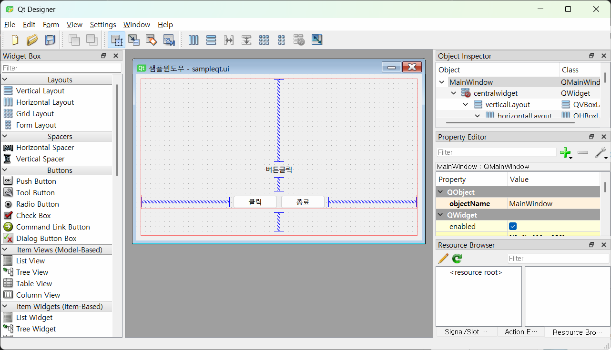

## 토이프로젝트 
PYTHON GUI - Oracle 연동 프로그램 

### GUI 프레임워크 
    1. tkinter - 파이썬 내장된 GUI 라이브러리 . 중소형 프로그램 사용 . 간단하게 사용가능 .안이쁨 
    2. PyQt / PySide 
        - C/C++에서 사용하는 GUI 프레임워크 Qt를 파이썬에 사용하게 만든 라이브러리.현재 6버전 출시. 유료 
        - PyQt의 사용라이선스 문제로 Pyside 릴리즈 . PyQt에서 PySide변경하는 데 번거로움 존재 
        - tkinter 보다 난이도가 있음
        - 아주 예쁨 QtDesigner툴로 포토샵처럼 GUI를 디자인 가능 
        - Python GUI 중에서 가장 많이 사용 중 
    3. Kivy 
        - OpenGL(게임엔진용 3D 그래픽엔진 ) 으로 구현되는 GUI 프레임워크 
        - 안드로이드나,iOS 등 모바일용으로도 개발 가능 
        - 최신에 나온 기술이라 아직 불안정 
    4. wxPython 
        - Kivy 멀티플랫폼 GUI 프레임워크 
        - 무지 어려움 

### PyQt5 GUI 사용 
- PyQt5 설치 
    - 콘솔 `pip install PyQt5` 

- QtDesigner 설치 
    - [https:](https://build-system.fman.io/qt-designer-download)
    
#### PyQt5 개발 
1. PyQt 모듈 사용 윈앱 만들기 
2. 윈도우 기본설정 
3. PyQt 위젯 사용법(레이블,버튼, ...)
4. 시그널(이벤트) 처리 방법 
5. QtDesigner로 화면 디자인, PyQt와 연동 
    

- Python 오라클 연동 테스트 
    - 오라클 모듈 
        - oracledb - Oracle 최신버전에 매칭
        - **cx_Oracle** 구버전까지 잘됨 
        - 콘솔에서 `pip install cx Oracle`
        - Microsoft C++ Build Tools 필요
- QtDesigner로 화면 구성 
- PyQt로 Oracle 연동 CRUD 구현 